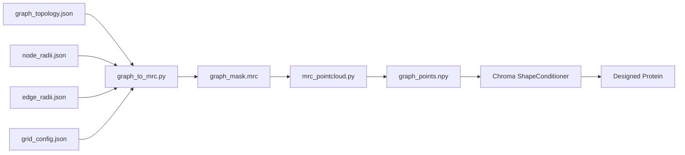

# Graph -> MRC -> PointCloud -> Chroma Protein Design

This repository now includes a complete bridge pipeline:

1. Graph topology + decoupled radii
2. Binary MRC mask generation
3. MRC to point cloud conversion
4. Point cloud conditioning for Chroma protein design

---

## What Is Included

- `graph_to_mrc.py`  
  Build binary MRC masks from graph-defined spheres/cylinders.
- `GRAPH_TO_MRC.md`  
  Detailed schema/API/CLI documentation for graph-to-MRC conversion.
- `mrc_pointcloud.py`  
  Bidirectional conversion between MRC and point clouds.
- `MRC_POINTCLOUD.md`  
  Detailed schema/API/CLI documentation for MRC-point cloud conversion.
- `examples_graph_mrc_pointcloud_chroma.py`  
  End-to-end runnable example script for full workflow.
- `run_mrc_chroma_shape.py` (repository root)  
  Reads [`configs/mrc_chroma_shape.yaml`](configs/mrc_chroma_shape.yaml) by default (`--i` overrides): **binarizes** the map at the resolved threshold (≥ threshold → 1, else 0), then adaptive coarsening until ≤ `max_voxels`. Use **`adaptive_pooling: binary_max`** (default) for **2×2×2 max-pool** on the mask (no FFT; stays 0/1), or **`mean_fft`** for the legacy **FFT + mean** path. **`run_chroma`** defaults to **`false`** (point cloud + QC only); set **`run_chroma: true`** in YAML or pass **`--chroma`** to run **`ShapeConditioner`** + **`Chroma.sample`**. Sampling behavior is controlled by:
  - `sampling_mode: serial | batch` (default `serial`)
  - `seed_schedule: increment | fixed` (used by serial mode)
  - `chroma_sample.samples`
  
  Notes:
  - Native `chroma.sample(samples=N)` is a batch call.
  - In this script, `sampling_mode: serial` converts `samples: N` into `N` calls of `chroma.sample(samples=1)` to reduce peak GPU memory.
  - `sampling_mode: batch` keeps native batch behavior.
  
  Writes under `projects/output/` (unless you change `output_dir` in YAML): **`module1_2_15A_points.npy`**, **`module1_2_15A_input_density_orthogonal.png`**, **`module1_2_15A_input_density_ge_threshold_else_zero_orthogonal.png`** (keep values above threshold, zero below), **`module1_2_15A_input_mask_orthogonal.png`**, **`module1_2_15A_final_density.mrc`**, **`module1_2_15A_final_density_orthogonal.png`**, **`module1_2_15A_points_orthogonal.png`**, **`module1_2_15A_overlay_points_on_final.png`**, **`module1_2_15A_overlay_points_on_input_mask.png`**, and run reports **`mrc_chroma_shape_run_report.json`** / **`mrc_chroma_shape_run_report.txt`**. With Chroma enabled, also **`module1_2_15A_shape_design.pdb`** / **`.cif`** or indexed multi-sample outputs. **matplotlib** is required for the PNGs.

From the repository root:

```bash
KMP_DUPLICATE_LIB_OK=TRUE OMP_NUM_THREADS=1 python run_mrc_chroma_shape.py --i configs/mrc_chroma_shape.yaml
```

Point cloud only (default): same command; Chroma sampling: add **`--chroma`** or set **`run_chroma: true`** in the YAML.

The default `--i` is `configs/mrc_chroma_shape.yaml`, so you can omit `--i` if you use that file.

---

## Input Design (Decoupled by Industry Practice)

Use separate files:

1. `graph_topology.json`  
   Only graph structure: node IDs, node coordinates, edge IDs, edge endpoints.
2. `node_radii.json`  
   Node radius map: `node_id -> radius_A`.
3. `edge_radii.json`  
   Edge radius map: `edge_id -> radius_A`.
4. `grid_config.json`  
   Grid setup: box shape, voxel size, origin.

All coordinates and radii are in Angstrom physical space.

---

## Quick Start

## 1) Generate template input files

```bash
python graph_to_mrc.py --i ./configs/graph_example_inputs.yaml
```

## 2) Build binary mask MRC from graph

```bash
python graph_to_mrc.py --i ./configs/graph_build_mask.yaml
```

## 3) Inspect MRC statistics

```bash
python mrc_pointcloud.py --i ./configs/mrc_inspect.yaml
```

For binary masks, threshold `0.5` is typically suitable.

## 4) Convert MRC to point cloud

```bash
python mrc_pointcloud.py --i ./configs/mrc_to_pc.yaml
```

## 5) MRC → point cloud → Chroma shape design (cryo-EM / density map)

```bash
KMP_DUPLICATE_LIB_OK=TRUE OMP_NUM_THREADS=1 python run_mrc_chroma_shape.py --i ./configs/mrc_chroma_shape.yaml
```

Edit `configs/mrc_chroma_shape.yaml` for `input_mrc`, threshold, and `output_dir`. By default **`run_chroma: false`** (writes `module1_2_15A_points.npy` and QC). For sampling, use **`--chroma`** or set **`run_chroma: true`**; tune **`shape_conditioner`**, **`chroma_sample`**, `sampling_mode`, and `seed_schedule` in the same file.

## 6) End-to-end script

```bash
python examples_graph_mrc_pointcloud_chroma.py
```

This script:

- writes a toy graph example
- builds graph mask MRC
- converts MRC to point cloud
- saves files for Chroma conditioning
- includes optional Chroma sampling block you can enable

(For density-map conditioning from an MRC file, prefer step 5 and `run_mrc_chroma_shape.py`.)

**Notebook:** [`example_mrc_pointcloud_chroma.ipynb`](example_mrc_pointcloud_chroma.ipynb) — same pipeline in Jupyter (QC PNGs → `module1_2_15A_points.npy` → load → Chroma sampling).

---

## Output Files You Should Expect

- `graph_mask.mrc`  
  Binary occupancy mask from graph geometry.
- `graph_points.npy`  
  Point cloud with shape `(N,3)` compatible with Chroma `ShapeConditioner`.
- `graph_points_for_chroma.npz` (from example script)  
  Includes points and metadata for reproducible downstream use.

---

## End-to-End Data Flow



---

## Notes

- **Dependencies:** Chroma workflows need the usual scientific stack; orthogonal QC figures from the root `run_mrc_chroma_shape.py` additionally require **matplotlib**.
- If masks look clipped, enlarge `box_shape_zyx` or adjust `origin_xyz_A`.
- If point cloud is too dense, increase threshold or set smaller `max_points_conditioner` in YAML.
- If point cloud is too sparse, lower threshold.
- Keep graph topology and radius files separate for maintainability and parameter sweeps.

## CLI Convention (Future Scripts)

- New scripts should accept `--i <config.yaml>` as the main CLI entry.
- Config should include explicit `task` and output paths.
- No hidden randomness should be introduced unless explicitly configured in YAML.

